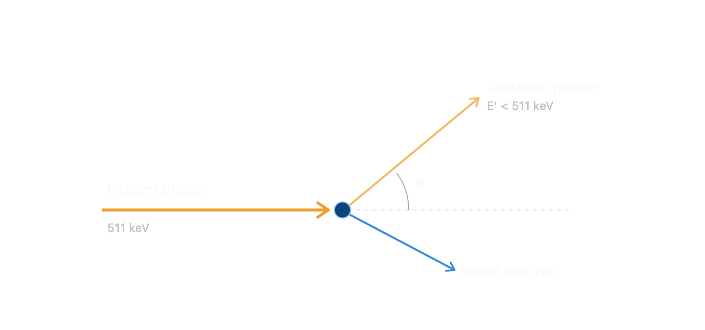
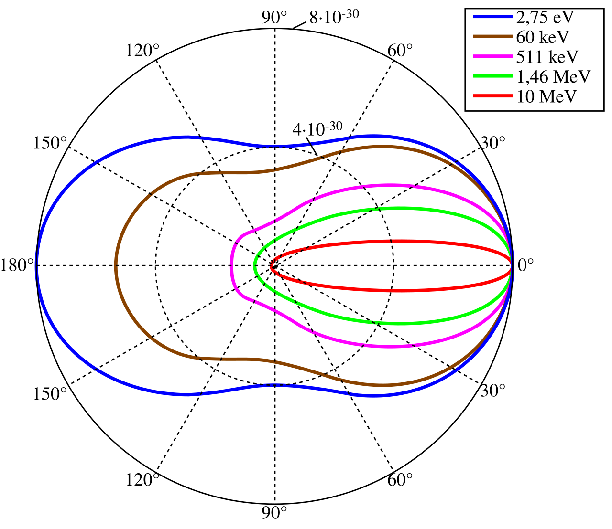
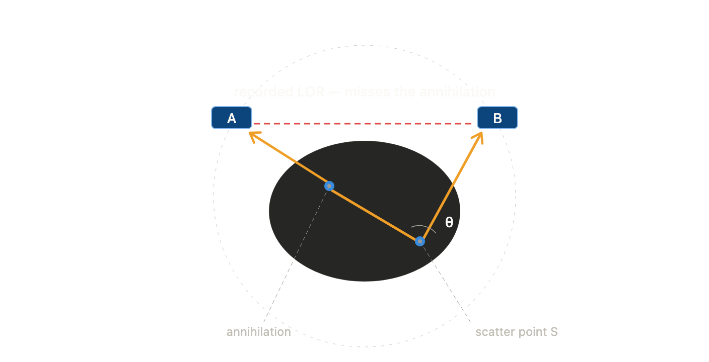

## Introduction to essential scatter physics in PET
Compton scattering is the inelastic (optical term) collision of a photon with a (treated as free, at-rest) electron: the photon transfers part of its energy and momentum to the electron, emerging with lower energy and a deflected direction. For 511 keV annihilation photons in soft tissue it dominates all other photon interactions by ~2 orders of magnitude, so "scatter" in PET essentially *means* Compton.

Here is a single event:

**1. Kinematics — how angle sets energy loss.** The scattered photon energy depends only on the scatter angle $\theta$:

$$E' = \frac{E_0}{1 + \dfrac{E_0}{m_e c^2}(1 - \cos\theta)},$$

where $E_0$ is the incident energy and $m_e c^2 = 511$ keV is the electron rest energy. PET gives a clean coincidence: $E_0 = 511 = m_e c^2$, so the ratio is exactly 1 and the formula collapses to $E' = 511 / (2 - \cos\theta)$ keV. Concretely:

- $\theta = 0°$ (grazing): $E' = 511$ keV — no energy lost.
- $\theta = 90°$: $E' \approx 256$ keV — half lost.
- $\theta = 180°$ (backscatter): $E' \approx 170$ keV — maximum loss.

So a singly-scattered 511 keV photon can never drop below ~170 keV.

**2. The energy window is the scatter filter.** PET detectors accept photons in $[E_\text{lo}, E_\text{hi}]$. Setting $E' = E_\text{lo}$ and solving for $\theta$ gives the largest scatter angle that still passes. For a 350 keV lower threshold: $2 - \cos\theta = 511/350 \Rightarrow \theta_\text{max} \approx 57°$. Photons scattered beyond ~57° are rejected; the surviving scatter is dominated by small-angle, small-energy-loss events. Implication: **the energy window and detector energy resolution are first-class variables.** A model trained at one window will mispredict at another, because the surviving scatter population changes.

**3. Cross-section — how likely each angle is.** The probability per solid angle of scattering into angle $\theta$ is the Klein–Nishina differential cross-section. At low energy the shape is symmetric (Thomson limit); at 511 keV it is **forward-peaked** — small-angle scatter is more probable than back-scatter.

For a flux $J$ (amount per area per time interval) of photons, we may defined the scattered amount of photons to be $N = \sigma J$, where $\sigma$ is the effective cross-section area ($m^2$). Think of $\sigma$ as a scatter filter (effective electrons that "scatter" the photon flux). Interestingly, this concept also works for a single particle. For a photon of energy $E$ scattering off a free electron at rest, with $\varepsilon = E/m_e c^2$ (dimensionless energy; $m_e c^2 = 511$ keV), the differential cross-section per solid angle (Klein–Nishina formula) is

$$\frac{d\sigma}{d\Omega} = \frac{r_e^2}{2}\left(\frac{E'}{E}\right)^2\left(\frac{E}{E'} + \frac{E'}{E} - \sin^2\theta\right),$$

where $r_e$ is the classical electron radius, $\theta$ is the scattering angle, and $E'$ is the Compton scattered-photon energy $\frac{E'}{E} = \frac{1}{1+\varepsilon(1-\cos\theta)}.$ This is derived by QED.

At low energy (Thomson limit), as $\varepsilon \to 0$, $E'/E \to 1$ for all angles, so the formula collapses to

$$\frac{d\sigma}{d\Omega} \to \frac{r_e^2}{2}(1+\cos^2\theta).$$

This is forward–backward symmetric: $\theta$ and $\pi-\theta$ give equal weight (since $\cos^2$ is symmetric under $\theta \to \pi-\theta$). At low energy the photon barely recoils the electron, so scattering is the classical electrodynamics dipole-radiation pattern.

At $E = 511$ keV, $\varepsilon = 1$. Now $E'/E$ depends strongly on angle: forward ($\theta \approx 0$) keeps $E'/E \approx 1$, while back-scatter ($\theta = \pi$) gives $E'/E = 1/(1+2\varepsilon) = 1/3$. The $(E'/E)^2$ prefactor suppresses large angles, breaking the symmetry toward the forward direction. The suppression grows with energy.

**4. From cross-section to attenuation length.** A single electron presents an effective target area $\sigma$ — the total Klein–Nishina cross-section, obtained by integrating $d\sigma/d\Omega$ over all solid angles. Multiplying by the electron number density $n_e$ converts this microscopic area into a macroscopic *rate per unit path length*:
$$\mu = n_e\,\sigma,\qquad n_e = \rho\,\frac{Z}{A}\,N_A,$$

where $\rho$ is mass density, $Z/A$ (material) is the atomic-number-to-mass-number ratio (close to $1/2$ for the light elements in tissue), and $N_A$ is Avogadro's number. The quantity $\mu$ is the **linear attenuation coefficient** (units: $\text{m}^{-1}$); its reciprocal $1/\mu$ is the **mean free path**, the average distance a photon travels before scattering once. For 511 keV photons in soft tissue $1/\mu \approx 10$ cm — comparable to the body itself, which is precisely why scatter is unavoidable in PET. (For a good geometry, a narrow beam and a detector that sees only unscattered photons, the scattered photons are considered as "lost". Thus $\mu$ is called the "attenuation" coefficient, which really isn't suitable for our case.)

**5. Single Scatter Simulation (SSS) — the physics baseline.**

The governing idea: assume every detected scattered coincidence arose from *exactly one* Compton event at a single point $S$ in the object. A true coincidence lies on the straight line joining the two detectors; a singly-scattered one follows a bent "dog-leg" path, so the recorded line of response does not pass through the annihilation. That mispositioning *is* the scatter background.

SSS estimates the scatter on detector pair $(A,B)$ by integrating the contribution of every candidate scatter point $S$ over the object volume (the Watson formulation, a physics forward model, not an approximation in its own derivation — the approximations are itemized below):

$$S_{AB} = \int_{V_S}\! dV_S\ \underbrace{\mu_S}_{\substack{\text{scatter prob.}\\\text{per length}}}\ \underbrace{\frac{1}{\sigma_C}\frac{d\sigma_C}{d\Omega}\bigg|_{\theta_{ASB}}}_{\substack{\text{K–N angular}\\\text{probability}}}\ \underbrace{\frac{\sigma_{AS}\,\sigma_{BS}}{4\pi R_{AS}^2 R_{BS}^2}}_{\substack{\text{geometric}\\\text{detection}}}\ \big(I_{A\to S\to B} + I_{B\to S\to A}\big).$$

Defining the symbols: $\theta_{ASB}$ is the scatter angle subtended at $S$ by the directions to the two detectors — fixed entirely by geometry, which is what lets the Klein–Nishina factor be evaluated; $R_{AS}, R_{BS}$ are the $S$-to-detector distances; $\sigma_{AS},\sigma_{BS}$ are the detector solid-angle/efficiency factors; and each emission term, e.g. $I_{A\to S\to B}$, is the activity integrated along the line from $A$ through $S$, weighted by attenuation survival on the unscattered leg (at 511 keV) and the scattered leg (511 keV up to $S$, then the reduced energy $E'$ from $S$ to $B$), times the detector's energy-window efficiency at $E'$. The two terms cover which of the two photons scattered.

What SSS requires as input: an activity estimate (usually a first, uncorrected reconstruction), an attenuation map $\mu(\mathbf{x})$, and the scanner geometry plus energy response. Its known weak points: (a) single scatter only — multiple-scatter (two or more Compton events) is ignored and patched afterward by scaling the model to the measured counts in the object-free "tails" of the sinogram; (b) it is iterative — scatter depends on the activity image, which depends on scatter correction, so you loop; (c) it hard-requires a trustworthy $\mu$-map.

## Machine-learning based scatter estimation principle (Claude; Unverified)

SSS is a *forward* model: given $(a,\mu,\text{geom})$, compute $s$ by explicit integration. A model is a learned *inverse-ish* map: given only the prompt sinogram $p=t+s$, predict $s$ directly, with the full Monte-Carlo scatter (all orders, all detector effects) as the training target.

The conceptual bet has three:

First, **the target is easy to represent.** Surviving scatter is small-angle, forward-peaked, low-frequency. A smooth, slowly-varying field is exactly what a convolutional/attention network approximates with few parameters — far easier than the trues.

Second, **the input already carries the object information that SSS gets from the $\mu$-map.** The trues $t$ are attenuation-weighted line integrals of the activity through the same electron-density field that produces the scatter. So $p$ implicitly encodes both $a$ and $\mu$ along every line. The model is betting it can recover the smooth functional $s = \mathcal{S}[a,\mu]$ from that implicit encoding, without you handing it $\mu$ explicitly. This is plausible *because* scatter depends mainly on path-integrated electron density, not on fine voxel detail — the very thing line integrals preserve.

Third, **MC ground truth dominates SSS on physics it can't model.** Your labels include multiple scatter and detector blurring natively, so a well-trained model can in principle beat SSS's single-scatter-plus-tail-fit on large or heterogeneous objects, at one forward-pass of inference cost instead of an iterative integral.

The cost of the bet — state it plainly in your thesis, because reviewers will: SSS generalizes by construction (it is physics); your model generalizes only over its training distribution. Withholding $\mu$ makes the inverse under-determined, so the network leans on the learned prior $P(\mu \mid p)$. If a test object's activity–attenuation relationship sits outside what you sampled, the prediction degrades silently and undiagnosably. This is the precise reason the data-design conversation we had earlier is load-bearing: the training distribution *is* the model's entire notion of physics.

**Framing slogan + stress test:** *SSS computes scatter from the object; the network recognizes scatter from its shadow in the data.* Holds when (i) scatter is smooth and low-frequency, and (ii) the prompt sinogram statistically determines the object well enough that $\mu$ need not be given. It breaks where SSS also struggles but for the opposite reason: very large/dense objects (multiple scatter no longer a smooth perturbation), or out-of-distribution geometry/activity where the learned prior is simply wrong — SSS would still be roughly right there, your model would not.

So the clean research question your write-up is converging on: *can a network, given only the prompt sinogram and no attenuation map, match or beat SSS by exploiting full-physics MC labels — and over what distribution of objects does that hold before it fails?* The "over what distribution" clause is the contribution; the yes/no is almost certainly "yes, in-distribution."

Want me to sketch the next two sections — how the scatter sinogram is actually formed from MC events (so you can validate your `.vox` pipeline against the smoothness/tail behavior SSS assumes), or the concrete train/eval protocol that would let you make the "beats SSS in-distribution, degrades OOD" claim rigorously?